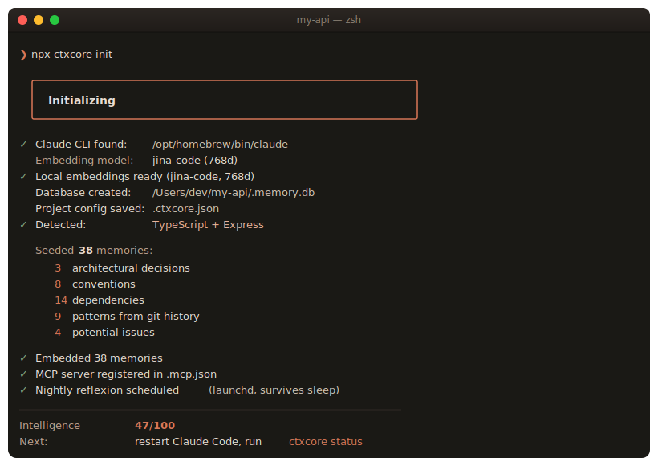
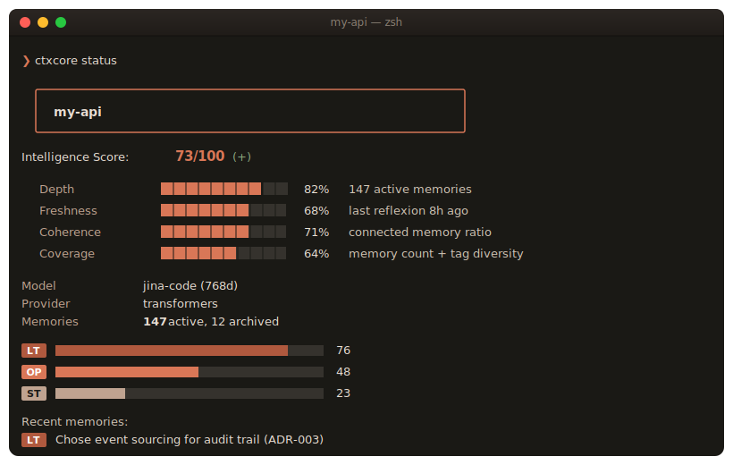
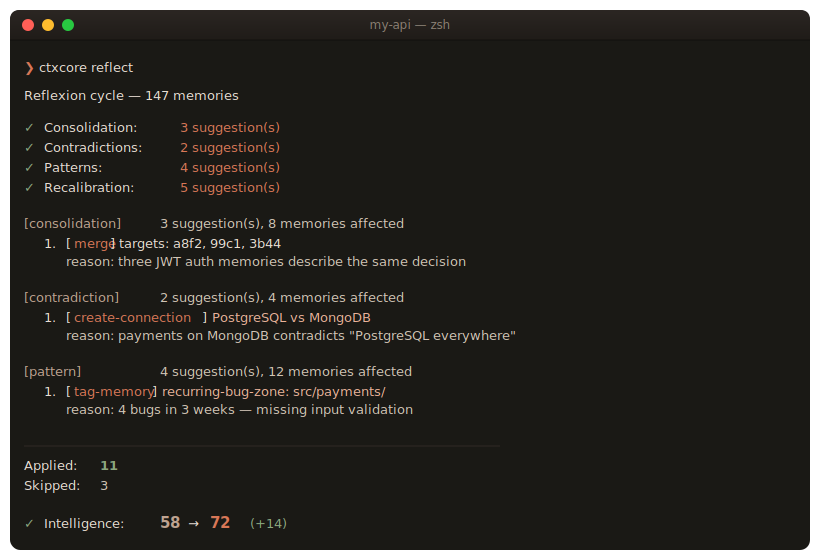
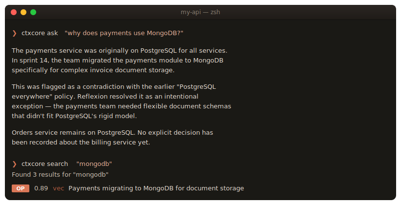
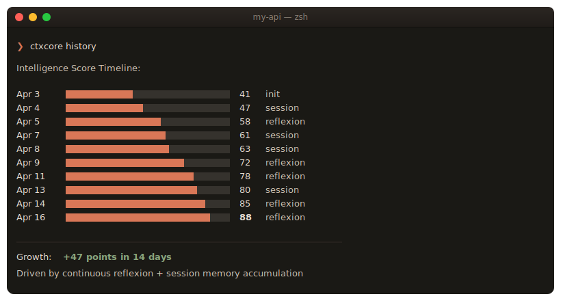

```
  ██████╗████████╗██╗  ██╗ ██████╗ ██████╗ ██████╗ ███████╗
 ██╔════╝╚══██╔══╝╚██╗██╔╝██╔════╝██╔═══██╗██╔══██╗██╔════╝
 ██║        ██║    ╚███╔╝ ██║     ██║   ██║██████╔╝█████╗
 ██║        ██║    ██╔██╗ ██║     ██║   ██║██╔══██╗██╔══╝
 ╚██████╗   ██║   ██╔╝ ██╗╚██████╗╚██████╔╝██║  ██║███████╗
  ╚═════╝   ╚═╝   ╚═╝  ╚═╝ ╚═════╝ ╚═════╝ ╚═╝  ╚═╝╚══════╝
   Persistent memory for Claude Code
```

<p align="center">
  <strong>Project intelligence for Claude Code.</strong><br>
  It doesn't just remember what happened — it understands why your project is the way it is.
</p>

<p align="center">
  
  = 20">
  
  
  
</p>

<p align="center">
  <a href="#quick-start">Quick Start</a>
  ·
  <a href="#what-it-does">What It Does</a>
  ·
  <a href="#commands">Commands</a>
  ·
  <a href="#how-it-works">How It Works</a>
  ·
  <a href="docs/architecture.md">Architecture</a>
</p>

---

## What It Does

Every AI memory tool records what happened. ctxcore **understands why your project is the way it is** — and that understanding refines itself every day.

<p align="center">
  
</p>

One command. Claude Code already knows your architecture, conventions, and key decisions — not from a template, but from your actual code, git history, and config files.

---

## The Intelligence Score

ctxcore gives your project a **visible, growing measure of how well it's understood**. It's not a vanity metric — it's the system telling you where it's strong and where it needs attention.

<p align="center">
  
</p>

Four dimensions, each worth 25 points:

| Dimension | What it measures | How to grow it |
|---|---|---|
| **Depth** | Tier-weighted memory count × importance | Use Claude Code — decisions and breakthroughs promote to long-term |
| **Freshness** | Weighted average actuality across memories | Access memories via search — reflexion keeps important ones fresh |
| **Coherence** | Connected memories in the knowledge graph | Reflexion draws causal/contradicts/supports edges automatically |
| **Coverage** | Memory count (log scale) + tag diversity | Work across the whole codebase — each module earns coverage |

---

## Reflexion: Smarter While You Sleep

Between sessions, ctxcore runs a reflexion cycle. It uses Claude to analyze its own knowledge — consolidating fragments, finding contradictions, detecting patterns, and recalibrating importance.

<p align="center">
  
</p>

A daily `launchd` agent (or `cron` on Linux) runs this at 2:23 AM. If your Mac was asleep, it catches up on wake. If you run any `ctxcore` command after 24h of inactivity, it silently triggers a background reflexion. **You never notice it running.**

---

## Natural Language Over Your Knowledge

Ask Claude Code *about your own project* and get answers grounded in the actual decisions, not vibes.

<p align="center">
  
</p>

Every answer cites the memories it drew from. You can trace every claim back to a specific decision, session, or reflexion.

---

## Watch It Grow

<p align="center">
  
</p>

**Day 1**: scan finds architecture, dependencies, git patterns. Intelligence around **40-50**.
**Week 1**: you work, memories accumulate, decisions promote to long-term. Intelligence crosses **60**.
**Week 2**: reflexion consolidates fragments, detects contradictions. Intelligence approaches **75**.
**Month 1**: your AI has deeper understanding than any CLAUDE.md could provide. Intelligence **85+**.

---

## Quick Start

### Prerequisites
- **Node.js** >= 20
- **Claude CLI** — for project analysis and reflexion ([install](https://docs.anthropic.com/en/docs/claude-code))

### Zero-config install

```bash
cd your-project
npx @startfast-ai/ctxcore init
```

That's it. Start Claude Code — the memory system is active. Embeddings run **locally** via Transformers.js (no Ollama needed, no API key, no network after initial model download).

### Or install globally

```bash
npm install -g @startfast-ai/ctxcore
ctxcore init
```

### As a Claude Code Plugin

```bash
/plugin install ctxcore
```

---

## How It Works

### Three memory tiers mirror human memory

| Tier | Holds | Decay | Example |
|---|---|---|---|
| **Short-term** | Session context, working notes | Hours | "Debugging auth timeout in session.ts" |
| **Operational** | Active project knowledge | Weeks | "Auth retry count set to 3 after timeout fix" |
| **Long-term** | Architecture, key decisions | Months | "Chose event sourcing for audit trail (ADR-003)" |

Frequently accessed memories promote upward. Unused ones fade and archive — never deleted, just quiet.

### Automatic importance classification

| Level | Range | What triggers it |
|---|---|---|
| **Routine** | 0.1–0.3 | Variable renames, formatting, minor edits |
| **Operational** | 0.3–0.6 | Bug fixes, feature implementations |
| **Decision** | 0.6–0.8 | Architecture choices, library selections |
| **Breakthrough** | 0.8–1.0 | Root cause discoveries, key insights |

### Knowledge graph with typed edges

```
chose event sourcing ──causal──▶ CQRS pattern ──causal──▶ read model sync bug
       │                                                         │
       └────────── supports ──────────▶ audit trail requirement
                                                                 │
                                                solution: eventual consistency
```

Edges are one of: `causal`, `contradicts`, `supports`, `temporal`, `similar`.

### Decay formula

```
decay_rate = base_decay × (1 − importance × 0.7)
actuality  = actuality × (decay_rate ^ hours_since_last_touch)
score      = similarity × actuality × (1 + importance) + graph_boost
```

Important memories resist decay. Frequently accessed memories stay fresh. Unused memories fade naturally. Nothing is deleted — just archived below the retrieval threshold.

---

## Commands

### Setup
```bash
ctxcore init                         # Initialize (auto-detects everything)
ctxcore init --force                 # Re-initialize from scratch
ctxcore doctor                       # Diagnose installation issues
```

### Memory
```bash
ctxcore store "content"              # Store with auto-classification
ctxcore search "query"               # Semantic + keyword search
ctxcore ask "How does auth work?"    # RAG over knowledge with citations
ctxcore status                       # Intelligence score + memory stats
ctxcore export                       # Dump all memories as JSON
```

### Intelligence
```bash
ctxcore reflect                      # Full reflexion cycle (all four modes)
ctxcore reflect --consolidate        # Merge related memories
ctxcore reflect --contradictions     # Find and resolve conflicts
ctxcore reflect --patterns           # Detect recurring themes
ctxcore reflect --recalibrate        # Adjust importance scores
ctxcore contradictions               # View all detected contradictions
ctxcore patterns                     # View detected patterns
ctxcore history                      # Intelligence score timeline
ctxcore onboard                      # Generate project briefing
```

### Preferences
```bash
ctxcore preferences list
ctxcore preferences add "Always use raw SQL, never ORMs"
ctxcore preferences forget <id>
```

### Project analysis
```bash
ctxcore rescan                       # Full re-analysis
ctxcore rescan --incremental         # Only changes since last scan
```

### Automation
```bash
ctxcore schedule --cron "0 2 * * *"  # Nightly reflexion (uses launchd on macOS)
ctxcore hooks install                # Git post-commit + post-merge hooks
```

### Visualization
```bash
ctxcore visualize                    # Local knowledge graph UI
ctxcore diff --since yesterday       # What changed in memory
```

---

## MCP Tools

Available to Claude Code automatically after init:

| Tool | What it does |
|---|---|
| `memory_context` | Load project intelligence at session start |
| `memory_search(query)` | Semantic + keyword search across all memories |
| `memory_store(content)` | Store new knowledge with auto-classification |
| `memory_decide(content)` | Record a decision (high importance, auto-tagged) |
| `memory_reflect` | Trigger a reflexion cycle |
| `memory_task_*` | Task and kanban management (create, update, comment, list, link) |
| `memory_spec_*` | Specification documents (create, read, update, list, link) |

---

## Tech Stack

| Component | Choice | Why |
|---|---|---|
| Language | TypeScript (strict, ESM) | Type safety + first-class Claude Code ecosystem |
| Storage | SQLite + sqlite-vec | Single file, zero ops, native vector search |
| Embeddings | Transformers.js (`jina-code`, default) or Ollama | Local, private, 768d code-optimized, 8K context |
| Reflexion | Claude CLI subprocess | Highest-quality reasoning on knowledge |
| Protocol | MCP (Model Context Protocol) | Native Claude Code integration |
| CLI | Commander.js | Predictable subcommand UX |
| Tests | Vitest | 511 passing, 16 live AI tests |

---

## Documentation

| Document | What it covers |
|---|---|
| [Architecture](docs/architecture.md) | System design, memory model, reflexion, scoring |
| [CLI Reference](docs/cli.md) | Every command and flag |
| [MCP Tools](docs/mcp.md) | Tool schemas for Claude Code integration |
| [Configuration](docs/configuration.md) | Config files, environment variables, scheduling |

---

## Contributing

ctxcore is in active development. Issues, ideas, and pull requests are welcome. See [CONTRIBUTING.md](CONTRIBUTING.md) for how to get set up locally and run the test suite.

---

## License

[MIT](LICENSE) — free to use, modify, and distribute.
